# AI Champions Hub

**A complete, end‑to‑end Power Apps solution for running an AI / Copilot enablement program.**

AI Champions Hub is delivered as a **fresh, self‑contained solution** — importing it into any
Power Platform environment provisions the entire **Dataverse data model** (13 tables, option sets
and relationships), **two ready-to-assign security roles**, **and the React Code App itself** —
all in one solution import. Nothing is assumed to
pre‑exist: you get the database, the app, and the connector wiring from scratch.

The app helps a program run day to day: onboarding champions, launching learning campaigns,
tracking point‑based activity claims with evidence, scheduling events, ranking a leaderboard,
triaging license/connector requests, reporting to leadership, and self‑branding the experience.

> **Deploying to a new tenant?** Follow **[`deploy/DEPLOYMENT.md`](./deploy/DEPLOYMENT.md)** — it
> walks through importing the schema solution and pushing the Code App, end to end.

---

## What's in the box

| Layer | Delivered as | Contents |
|-------|--------------|----------|
| **Everything, one package** | `deploy/solutions/AIChampionsHubApp_managed.zip` (and `_unmanaged.zip`) | 13 Dataverse tables, option sets, relationships, **2 ready-to-assign security roles**, **and the bundled Code App** — a single import provisions the whole solution. Publisher **ABSGSA**, prefix `abs` |
| **App source** | This repository (Vite + React + TypeScript) | The full Code App source; also deployable/updatable directly with `pac code push` |
| **Connector** | `power.config.json` | **Office 365 Users** (people picker) + the 13 Dataverse data sources |

The package contains **only this app's data model** — no unrelated or previous app is referenced.

---

## Screenshots

| | |
|---|---|
| **Home** — five KPI cards (incl. *Campaigns At Risk* & *Trending Campaign*), pending claims, open requests, completion donut, top champions | 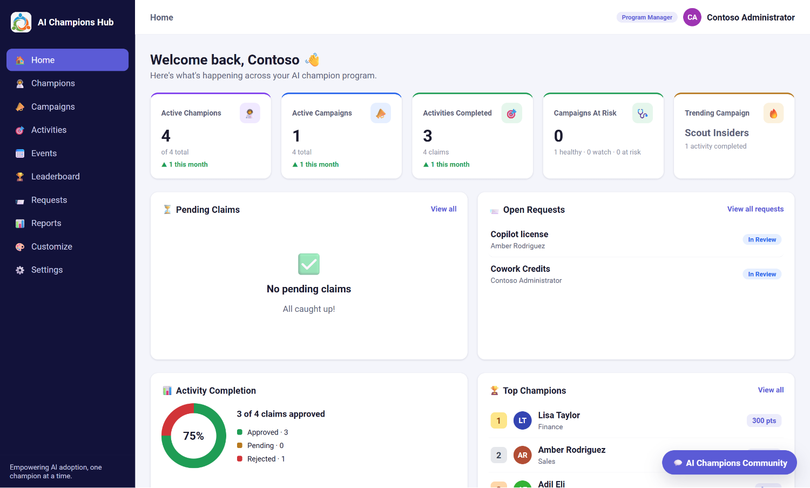 |
| **Champions** — KPIs, search + status/department filters, per‑card admin **edit / disable / remove** | 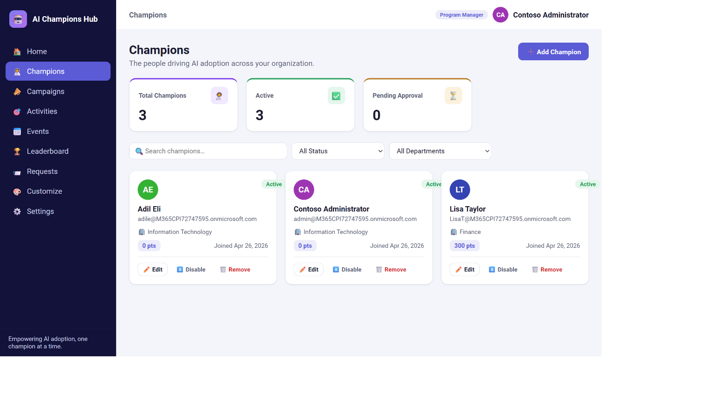 |
| **Campaigns** — banner‑image cards grouped into Active / Drafts / Expired / Completed with health badges | 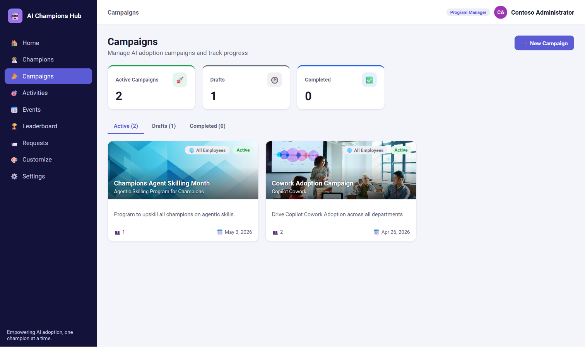 |
| **Campaign detail** — banner header, health score, overview, audience, activities / participants / events tabs | 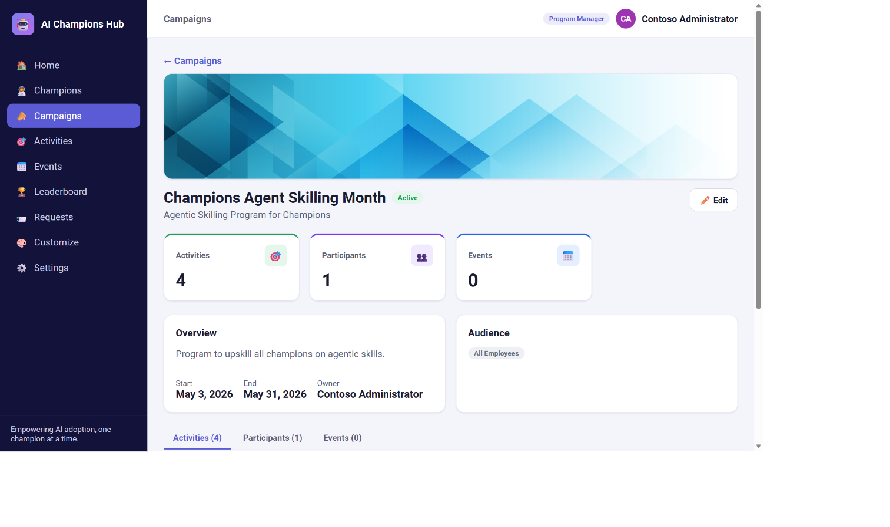 |
| **Activities** — catalog + claims, filter by type **and campaign**, evidence upload, approve / reject | 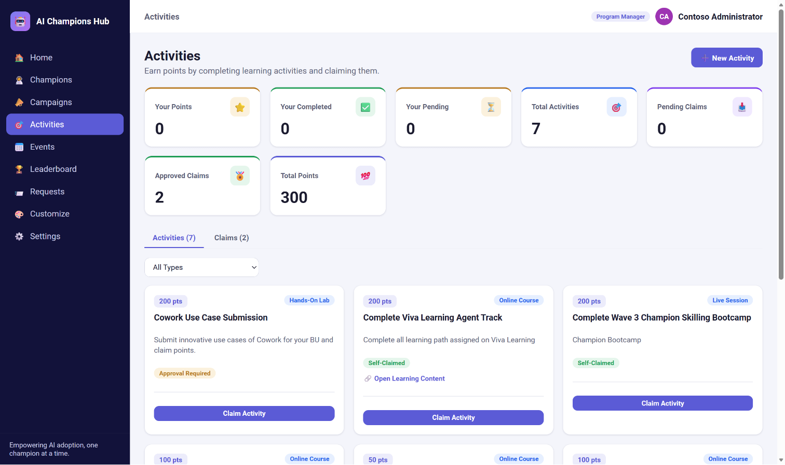 |
| **Events** — month calendar + upcoming list | 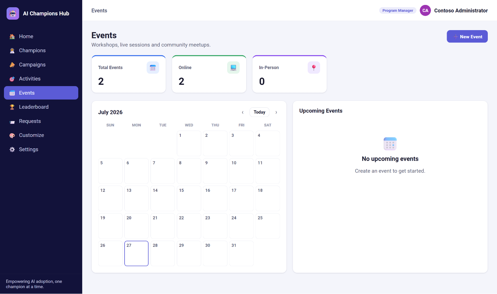 |
| **Leaderboard** — champions / departments / campaigns ranking | 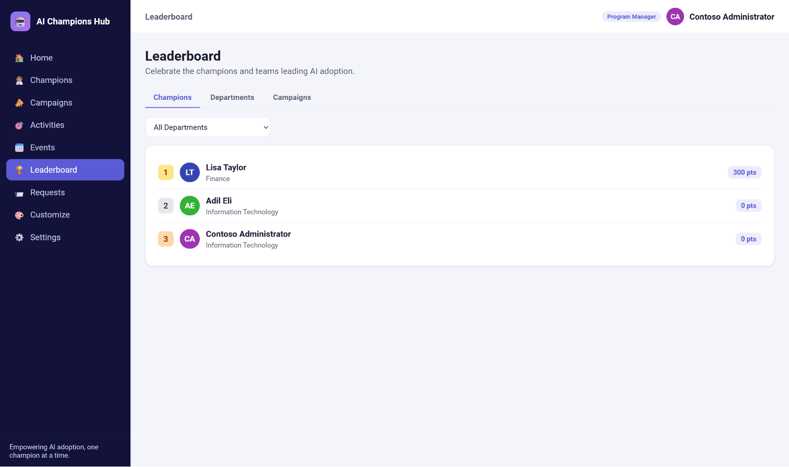 |
| **Requests** — KPIs, filters, submit + threaded triage | 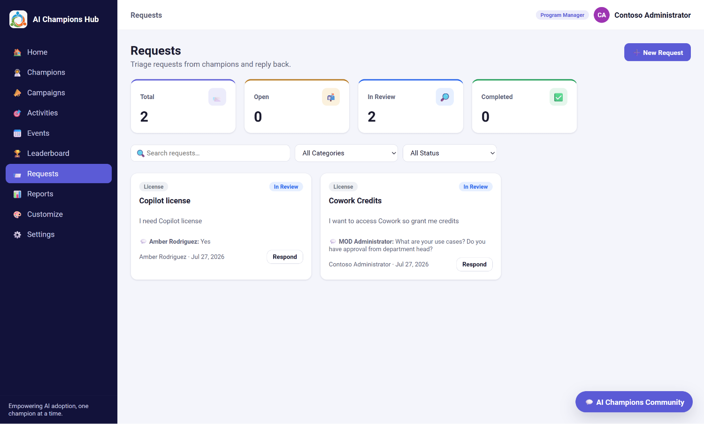 |
| **Reports** *(admin)* — executive KPIs, department & type breakdowns, monthly trend, campaign performance (RAG), CSV / PDF export | 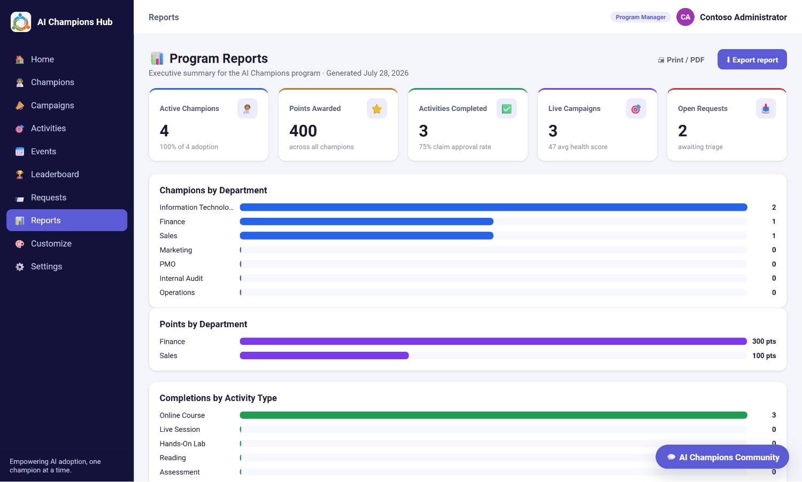 |
| **Customize** — per‑user Light/Dark, font family & size with live preview | 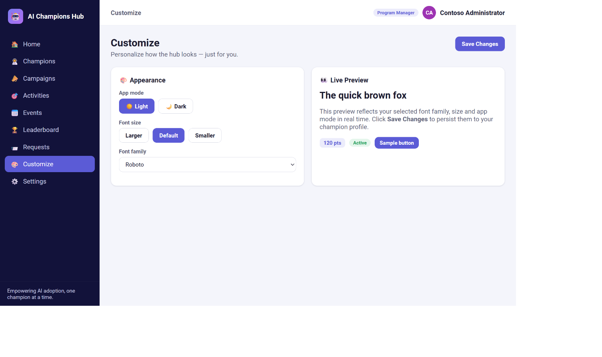 |
| **Settings** — program config, application admins & departments | 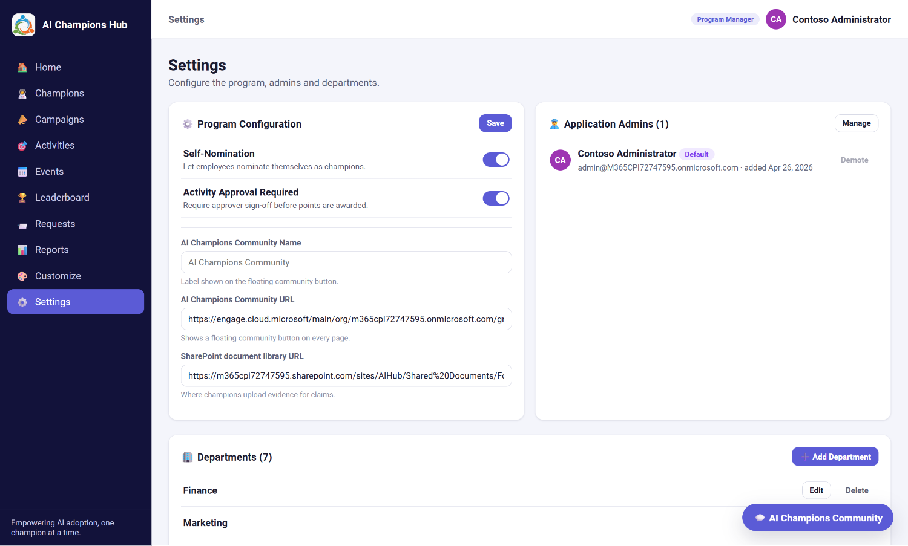 |
| **First‑run setup** — the app owner is granted temporary admin on a fresh, unconfigured program and prompted to become the permanent admin | 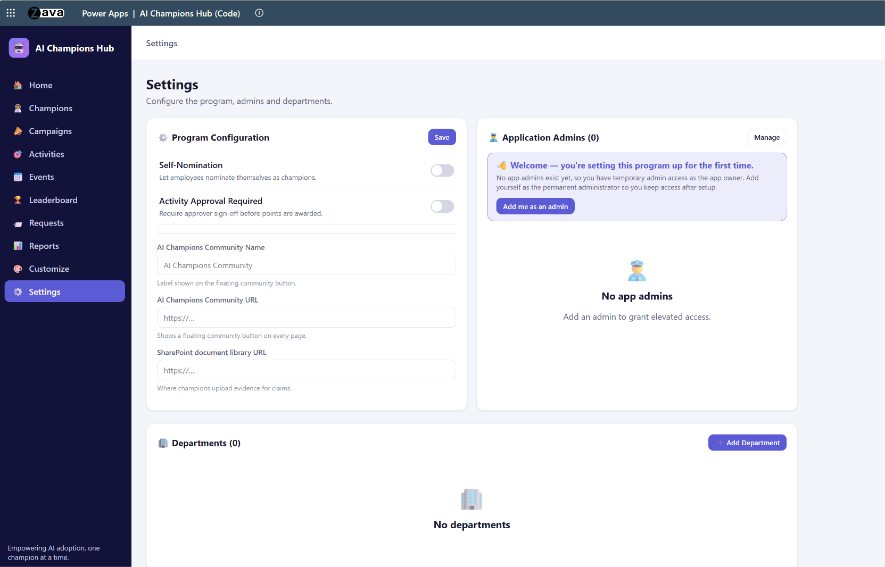 |
| **App Theme & Branding** *(admin)* — brand color presets or custom hex + app logo upload, applied across the whole app | 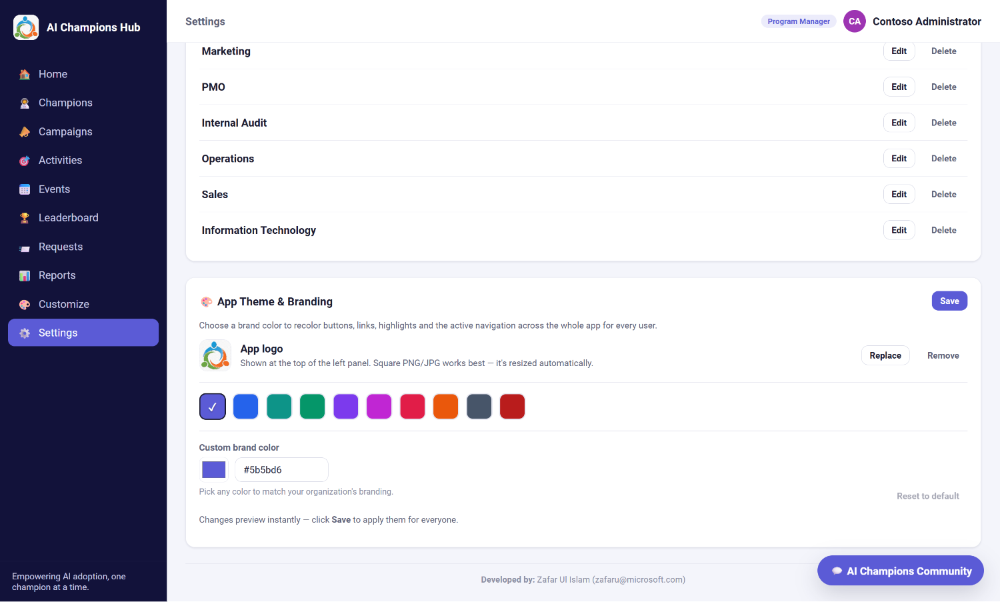 |

---

## Solution architecture

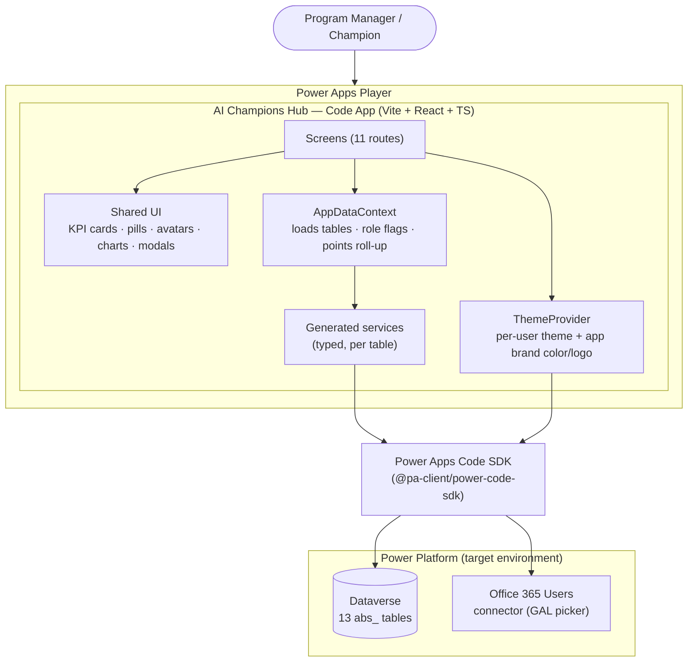

**How it fits together**

- **Screens** (one per route) render the UI and call into a single **`AppDataContext`** that loads
  every table once, exposes lookup maps + the signed‑in user, computes role flags
  (`isAdmin` / `isProgramManager` / `isAppAdmin`) and the points roll‑up.
- **Generated, typed services** (regenerated by `pac code add‑data‑source`) are the only path to
  Dataverse — no raw fetch. The **Code SDK** handles auth and transport.
- **ThemeProvider** applies each champion's personal Light/Dark + font preferences *and* the
  admin‑set application brand color + logo to CSS variables at the document root.
- The **Office 365 Users** connector powers the GAL people picker used when adding champions.

---

## Data model

Importing the solution creates these 13 tables (publisher **ABSGSA**, prefix `abs`; several
columns carry the legacy `crd49_` prefix). Choice columns are integers with base `839560000`;
all values + labels live in [`src/lib/enums.ts`](./src/lib/enums.ts).

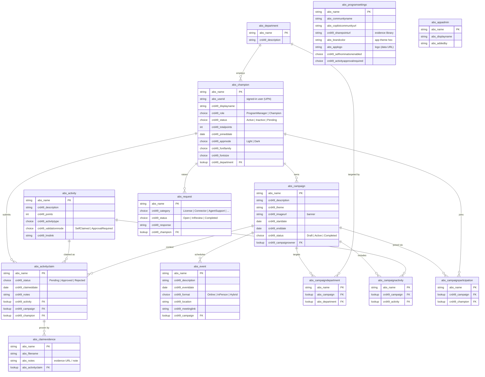

| Area | Table | Purpose |
|------|-------|---------|
| People | `abs_champion` | Champion profile: user id, role, status, department, points, per‑user theme |
| Org | `abs_department` | Departments |
| Programs | `abs_campaign` | Learning campaigns: theme, banner, dates, status, owner |
| Learning | `abs_activity` | Activities: type, points, validation mode, LMS link |
| Claims | `abs_activityclaim` | A champion's claim of an activity (status, points context) |
| Evidence | `abs_claimevidence` | Evidence link/note attached to a claim |
| Events | `abs_event` | Events: date, format, location/link, campaign |
| Requests | `abs_request` | License/connector/support requests with threaded response |
| Join | `abs_campaigndepartment` | Campaign ↔ department audience (M:N) |
| Join | `abs_campaignactivity` | Campaign ↔ activity (M:N) |
| Join | `abs_campaignparticipation` | Campaign ↔ champion enrollment (M:N) |
| Config | `abs_programsettings` | Single settings row: community, SharePoint URL, branding, toggles |
| Admin | `abs_appadmin` | Application‑admin allow‑list |

---

## Routes & screens

| Route | Screen | Highlights |
|-------|--------|------------|
| `/` | Home | KPI cards with colored accents + deltas — Active Champions, Active Campaigns, Activities Completed, **Campaigns At Risk**, **Trending Campaign**; pending claims, open requests, completion donut, top champions |
| `/champions` | Champions | KPIs, search + status/department filters, add‑champion (GAL picker), per‑card **edit / disable / remove** (disable revokes app access) |
| `/campaigns` | Campaigns | banner‑image cards in Active/Drafts/Expired/Completed tabs, health (RAG) badges, participant counts, new campaign |
| `/campaigns/:id` | Campaign detail | banner header, health score, overview, audience, activities/participants/events tabs, join button (champions), edit (admin) |
| `/activities` | Activities | catalog + claims tabs, filter by type **and campaign**, new activity, claim with evidence, approve/reject |
| `/events` | Events | month calendar + upcoming list, new event |
| `/leaderboard` | Leaderboard | champions / departments / campaigns ranking, department filter |
| `/requests` | Requests | KPIs, filters, submit request, threaded triage |
| `/reports` | Reports *(admin)* | executive KPIs, department & activity‑type breakdowns, monthly trend, campaign performance (RAG), requests/events overview, CSV + Print/PDF |
| `/customize` | Customize | per‑user Light/Dark, font family & size — live preview + save |
| `/settings` | Settings *(admin)* | program config, application admins, departments, **App Theme & Branding** (color + logo) |

---

## Key features

- **Role gating.** Two layers work together. **In Dataverse**, the package ships two security
  roles — **AI Champions Hub Users** and **AI Champions Hub Admins** (see Deploy) — that grant the
  table privileges; assign them on import. **In the app**, the signed‑in user resolves to an
  `abs_champion` and/or `abs_appadmin` record. `isAdmin = isProgramManager || isAppAdmin`.
  Admin‑only actions (managing champions, campaigns, activities, claim approvals, events, request
  triage, reports and all of Settings) are hidden for regular champions.
- **Champion lifecycle & access control.** Admins can edit, **disable** (sets status Inactive) or
  remove a champion. A disabled champion is blocked at app startup by an access gate; admins are
  never locked out. Re‑enabling restores access.
- **Campaign‑gated activities.** Activities always live under a campaign. Champions only see and
  claim activities for campaigns they've **joined** and that are **live**; disabled/expired
  campaigns automatically make their activities non‑claimable (derived, no schema change).
- **Points & leaderboard.** Points come from **Approved** claims × `activity.points`; the
  leaderboard ranks champions, departments (summed) and campaigns.
- **Campaign health (RAG).** Each campaign is scored 0–100 (enrollment + pace) into
  Green/Amber/Red, surfaced on cards, detail, Home ("Campaigns At Risk") and Reports.
- **Per‑user personalization.** Each champion stores Light/Dark, font family and size (Customize),
  applied via CSS variables and reverted on unmount unless saved.
- **App‑wide branding (admin).** Settings → App Theme & Branding sets a brand color (presets or
  custom hex) that recolors buttons, links, highlights, active nav **and the left panel**, plus an
  uploaded **app logo** shown top‑left — stored on `abs_programsettings` for every user.

---

## Tech stack

- **Vite 7** + **React 19** + **TypeScript** (strict)
- **React Router** for the 11 client routes
- **Power Apps Code SDK** (`@pa-client/power-code-sdk`) — auth + Dataverse + connector access
- **Dataverse** — 13 tables provisioned by the solution package
- No charting library — Reports charts are lightweight inline SVG/CSS components

---

## Deploy to a new environment (fresh, end‑to‑end)

Full step‑by‑step (single-import + connections, incl. cross‑tenant) is in
**[`deploy/DEPLOYMENT.md`](./deploy/DEPLOYMENT.md)**. In short:

```powershell
# 1. Authenticate to the TARGET environment
pac auth create --environment <TARGET_ENVIRONMENT_ID>

# 2. Import the whole solution — tables + roles + the bundled Code App
pac solution import --path .\deploy\solutions\AIChampionsHubApp_managed.zip --publish-changes

# 3. In make.powerapps.com (target env) → Connections, create a Microsoft Dataverse
#    connection and an Office 365 Users connection, then open Apps → play the app.
```

**A single solution import provisions everything** — no separate app deployment step:

- The 13 Dataverse tables, option sets and relationships.
- **Two security roles** — **AI Champions Hub Users** (Create/Read/Write/Append/Append To on all 13
  tables) and **AI Champions Hub Admins** (same **+ Delete**). Assign **Users** to champions and
  **Admins** to program managers / app admins; no manual role setup needed.
- The **"AI Champions Hub (Code)" app** itself — the Code App is **bundled inside the solution**
  (packaged with `power-apps push --solution-id`), so it lands in the target as an installed app.

**After import, two things are still done by hand in the target environment:**

1. **Create the connections.** In `make.powerapps.com` → **Connections**, add a **Microsoft Dataverse**
   connection and an **Office 365 Users** connection (Code Apps bind connectors client‑side, so these
   don't travel inside the solution). Then **Apps → AI Champions Hub (Code) → Play**.
2. **Assign the two security roles** to your users (as above).

> ⚠️ **Caveat — Code App ALM is in preview.** The bundled app ships in the `.zip`, but if the imported
> app can't resolve its connections automatically on first play, redeploy it from source with
> `pac code push` against the target environment (see `deploy/DEPLOYMENT.md`, **Part 2 → Option B**).
> That same `pac code push` is also how you publish code updates after the initial import.

Then sign in as an admin and complete first‑run setup in **Settings** (community name/URL,
SharePoint evidence library URL, departments, admins, branding).

### First‑run experience (who's the first admin?)

A freshly imported program has **no app admins and no champions** yet. To avoid a lock‑out — where
the person who opens the app first has no way to grant themselves access — the app applies a
**bootstrap‑admin** rule:

> While **zero app admins** exist, the **signed‑in user is treated as an admin**, so the app owner
> can open **Settings** and set the program up.

On that first visit, the **Application Admins** card shows a welcome banner with an **“Add me as an
admin”** button:


- Clicking **Add me as an admin** writes the signed‑in user into the `abs_appadmin` table as the
  **permanent** administrator (no champion record required).
- As soon as **one** app admin exists, the bootstrap rule **switches off automatically** and normal
  role gating resumes — from then on only Program Managers / App Admins see Settings. The Manage
  Admins UI never lets the **last** admin be removed, so the program can't fall back into an
  admin‑less state.
- Best practice: click **Add me as an admin** first, then add departments, elevate other admins, and
  fill in program settings.

> **Note:** this bootstraps whoever opens the freshly deployed app first (typically the maker/owner
> who imported the solution). Add the real administrator right away so access is pinned to a known
> account.

### Versioning & upgrades (don't reset existing data)

The current version is shown at the **bottom of the left navigation panel** (e.g. `v1.0.1`) and is the
same number carried by the deployable solution (`v1.0.1` in the app → solution version `1.0.1.0`).

**To ship an update to a tenant that already has the app — without wiping its data — re-import as an
upgrade with a *higher* version number.** Dataverse only preserves existing rows when the incoming
solution version is greater than the installed one; re-importing the *same* version can fail or
overwrite, and installing a lower version is rejected.

```powershell
# Upgrade an existing install (data preserved), rather than a clean import:
pac solution import --path .\deploy\solutions\AIChampionsHubApp_managed.zip --import-as-holding --publish-changes
pac solution upgrade --solution-name AIChampionsHubApp
```

Because the version travels *inside* the exported `.zip`, every shipped change must bump the version
**before** the solution is re-exported. Keep these three in lock‑step:

| Where | File / command | Format |
| --- | --- | --- |
| App UI label | `src/version.ts` → `APP_VERSION` | `1.0.1` |
| npm package | `package.json` → `version` | `1.0.1` |
| Dataverse solution | `pac solution online-version --solution-name AIChampionsHubApp --solution-version 1.0.1.0` | `1.0.1.0` |

**Release checklist for any future change:**

1. Bump `APP_VERSION` in `src/version.ts` and `version` in `package.json` (e.g. `1.0.1` → `1.0.2`).
2. `npm run build`.
3. Set the online solution version: `pac solution online-version --solution-name AIChampionsHubApp --solution-version 1.0.2.0`.
4. Re-push + re-bundle the app: `npx power-apps push --solution-id <solution-id>`.
5. Re-export both zips: `pac solution export --name AIChampionsHubApp --path .\deploy\solutions\AIChampionsHubApp_managed.zip --managed true --overwrite` (and again `--managed false` for the unmanaged zip).
6. Commit the bumped sources **and** the refreshed zips together.

---

## Local development

```powershell
npm install
pac code run
```

`pac code run` starts the Code Apps host, and `npm run dev` (Vite, port 3000) serves the app. Open
the **Local Play** URL that the Vite Power Apps plugin prints. (`pac code run` can also print a play
URL that points at `localhost:3000`.)

## Build

```powershell
npm run build   # tsc -b && vite build  → dist/
```

---

## Project structure

```
src/
  App.tsx                # Router + provider tree (data → theme → toast) with loading/error gates
  index.css              # Theme tokens (light/dark) + brand variables + all component styles
  lib/
    enums.ts             # Option-set integer values + label maps + font stacks
    branding.ts          # Brand presets + color math + applyBrand() (drives CSS variables)
    access.ts            # Campaign/activity gating helpers
    campaignHealth.ts    # RAG scoring
    reports.ts           # Report data builders + CSV/print export
    format.ts            # Date/number helpers
  data/entities.ts       # Aliased services, model types, EntitySet + bind()
  generated/             # AUTOGENERATED by pac code add-data-source — do not edit
  context/AppDataContext.tsx   # Loads tables once; role flags; points roll-up; reload()
  theme/ThemeProvider.tsx      # Per-user theme + app brand color/logo → document root
  components/            # Layout, Modal, Toast, ui.tsx (Avatar/Pill/KpiCard/HealthBadge/…), charts.tsx
  screens/               # One file per route

deploy/
  DEPLOYMENT.md          # Cross-tenant deployment guide
  solutions/             # AIChampionsHubApp_managed.zip + _unmanaged.zip (tables + roles + bundled app)
```

---

## Working with data

Always go through the generated services and read `result.data`:

```typescript
import { ChampionsSvc } from "./data/entities";

const res = await ChampionsSvc.getAll({
  select: ["crd49_displayname", "crd49_totalpoints"],
  filter: "statecode eq 0",
  orderBy: ["crd49_totalpoints desc"],
  top: 50,
});
const champions = res.data ?? [];
```

- Lookups are set with an `@odata.bind` payload key (see `bind()` in `data/entities.ts`) and read
  from the `_<lookup>_value` field.
- Choice fields take integer values from `src/lib/enums.ts`.
- The `generated/` folder is regenerated by `pac code add-data-source`; don't hand‑edit it.

---

## Notes

- A harmless libuv `Assertion failed` line can print at the end of some `pac` commands on Windows;
  it does not affect the operation.

---

_Developed by **Zafar Ul Islam** ([zafaru@microsoft.com](mailto:zafaru@microsoft.com))._
